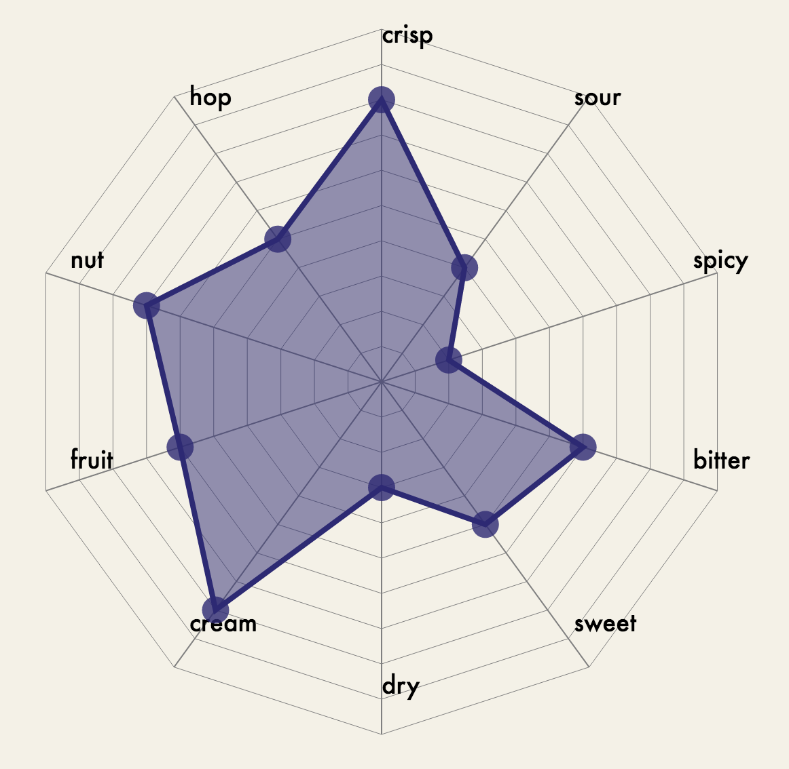
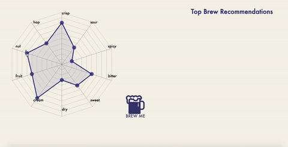

Taming of the brew is a beer discovery application focused on helping users describe the flavors of their favorite beers.

The beer category can be intimidating to newcomers. The proliferation of choice, combined with industry-specific terminology makes it difficult to feel confident about what you know or what you like. This application is designed to simplify the process of describing and identifying flavors of different beers.

Users can create personal taste maps to describe the taste profile of a beer.  Then, our application compares that map to a large database of other beer maps, and makes recommendations that match most closely.

We hope this app changes the way people who only buy and try a limited number of beers to try new brews that they know they will enjoy!

### Built by [Joshua Carrafa](https://github.com/carrafa), [Ash Hofferber](https://github.com/ajhofferber), [Kyle Stengline](https://github.com/kylestengline), and [Ethan Steiner](https://github.com/espa77)

### Some problems we are aiming to solve
 * Hard to try new beers or know if you will like them
 * Beer of choice not in stock/carried in store
 * Not knowing which beer to bring to a party

## Technology

A MEHN stack - MongoDB, Express.js, Handlebars.js, Node.js, using d3 interactions and animations for the taste map, and 3rd party API calls to 'untappd' database of beers.

### Challenges
Time crunch - we built this in less than 24 hours!

Accomplishments that I'm proud of: d3 interactions, taste mapping visual interface, logic for taste mapping, seeding the database with different beers

What's next for Taming of the Brew: Adding user profiles to save the taste map preferences. Adding different taste maps for each user based on mood. Crowd-sourcing taste map data to provide average of brew taste ratings from all users. Adding location mapping to find the brewery of, and the store that carries the recommended brews that is closest to you. Add food pairing data when selecting recommended brews.

## BrewHacks Hackathon Entry
